# Final project: Portfolio template

This project's objective is the creation of a web template for a creative's portfolio. It is focused on a retro-modernist style where black and white textures clash against vibrant red tones.

### Details

Project link: https://robi-fgn.github.io/RFGN_portfolio_template/  
Student: Robi Falagán Fernández  
Github user: @robi-fgn  

Course: Web Layout with Style Sheets  
Teacher: Rubén Vega Balbás  
Project: Final

### Tech Stack

- HTML5 — Semantic markup and document structure
- CSS3 — Custom styling, layout, and responsive design
- JavaScript (Vanilla) — DOM manipulation and interactivity without frameworks
- Bootstrap 5 — Responsive grid system and utility classes
- Google Fonts — Web typography loaded via CDN
- Git & GitHub — Version control and project repository hosting

### Setup Instructions

This project is a website built with HTML, CSS, and JavaScript. No build tools or package managers are required.

1. Clone or download the repository from GitHub.
2. Open the project folder in Visual Studio Code (or any code editor).
3. Make sure the project structure is preserved:
   - `index.html`
   - `404.html`
   - `about.html`
   - `contact.html`
   - `assets/`
     - `images/`
     - `css/`
       - `index.css`
       - `components.css`
     - `js/`
       - `script.js`

Optional (recommended):

- Use the **Live Server** extension in Visual Studio Code to preview changes in real time.

No additional configuration or dependencies are required to run the project locally.

### Customization Guide

1. Change the images in the `assests/images`folder for the ones that will be used for your project cards.

2. Read thoroughly the `index.html` document and customize each sections by following the green messages. Messages in ALL CAPS represent the names of each section, while lowercase messages give instructions about each customization available.

3. For each category in the gallery:

- Add a category card before the section's projects start (marked as "CATEGORY CARD" in the html).
- Edit the title of said category in the menu section and update the ID to match the category card.
- In case of adding new sections, copypaste an already existing section title from the menu, and make sure to update both the title and the ID.

4. For each project:

- Copy and paste a new project card
- Customize the project image, title and multiple details as specified in the messages inside of the project card.

5. Read thoroughly the `about.html` and `contact.html` documents and customize each sections by following the green messages, just like you did before for the homepage at `index.html`.

6. Once customized, verify that every link works correctly and has been updated to your own. Check:

- Every section in the menu
- "See more" button in project cards
- Footer links
- Contact email and phone number
- Contact links

### Screenshots

###### Homepage

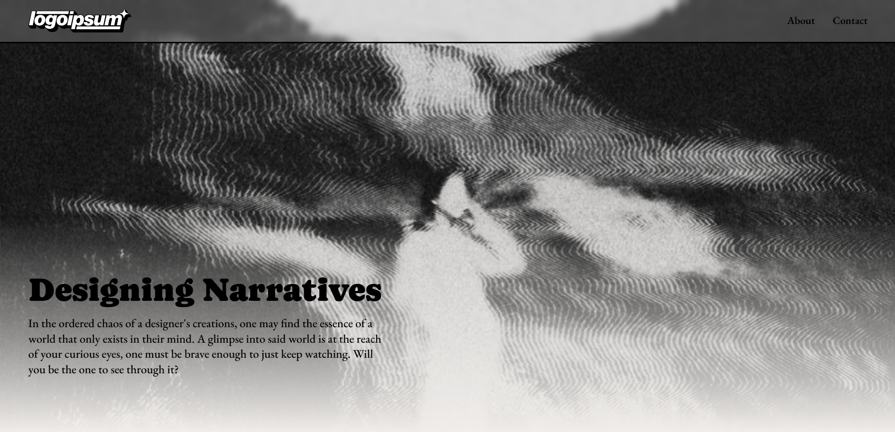
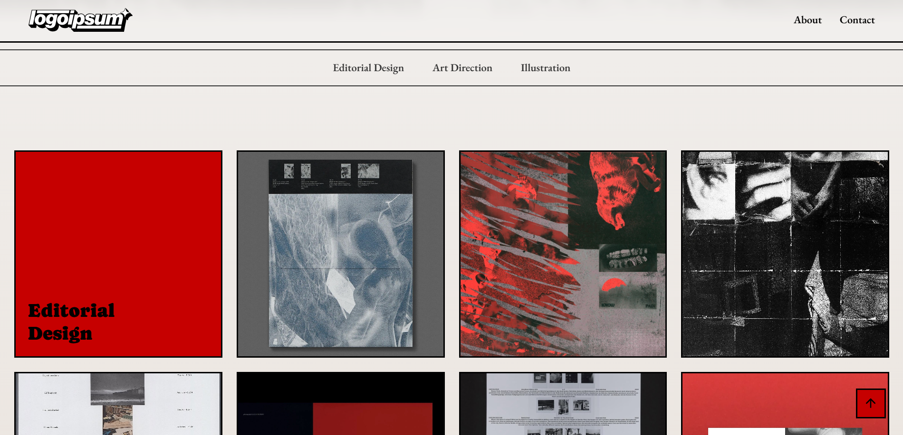
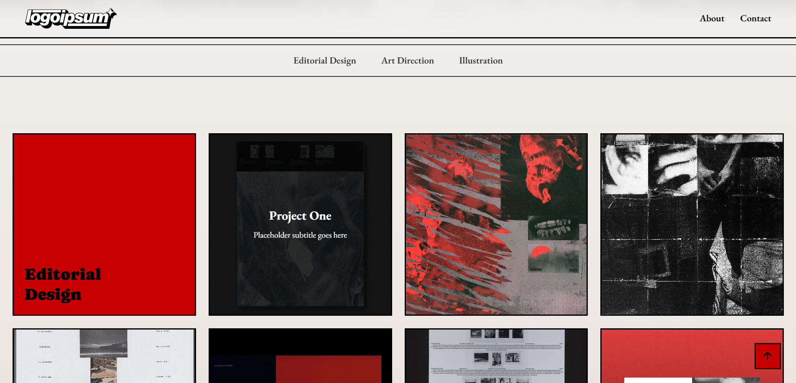
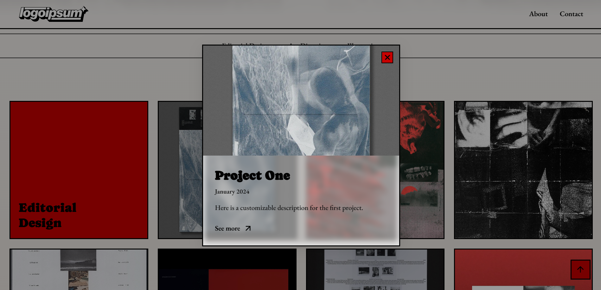
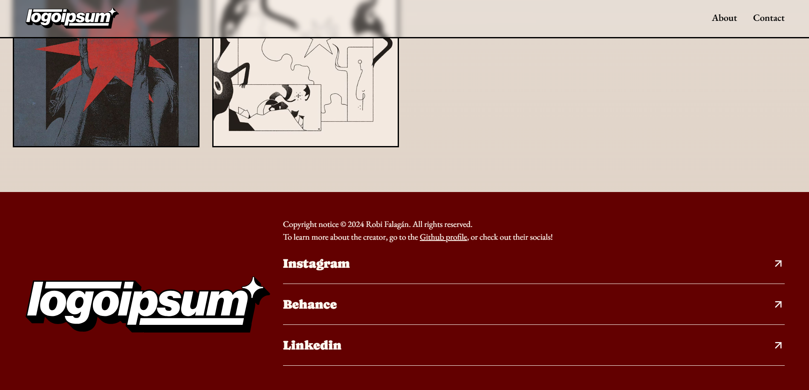

###### Side-pages

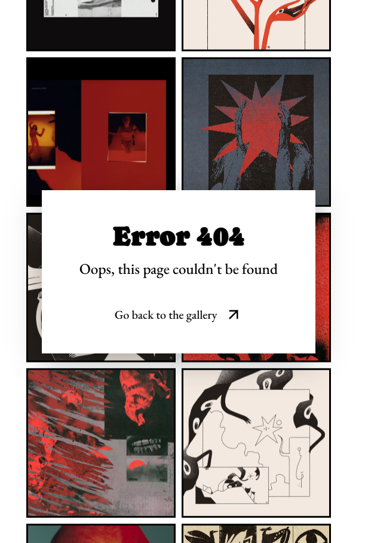
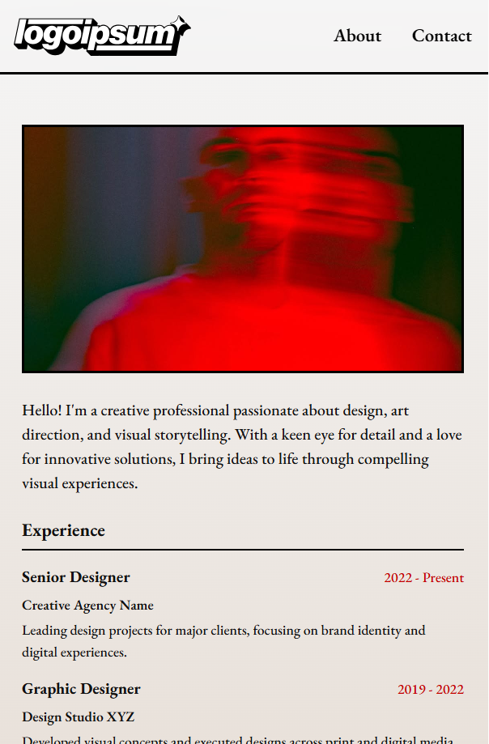
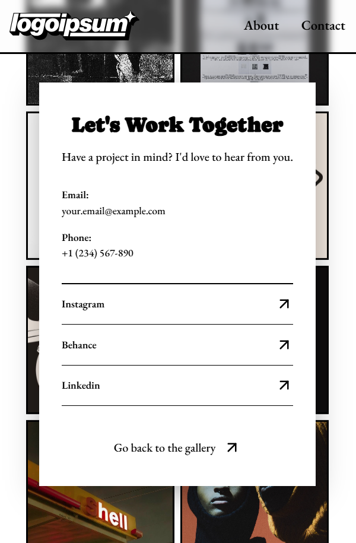
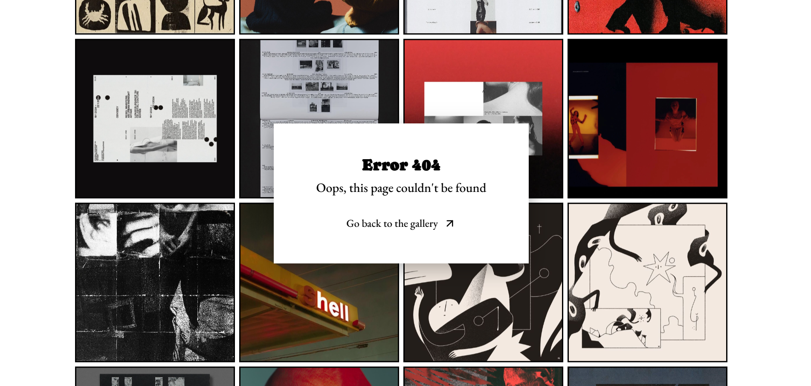
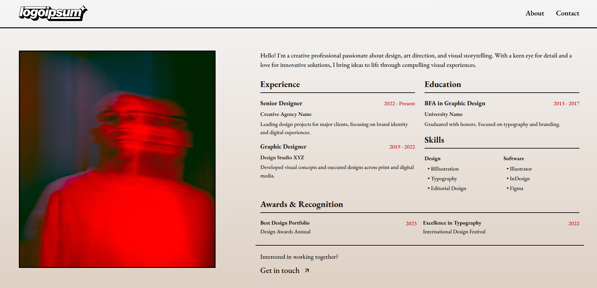
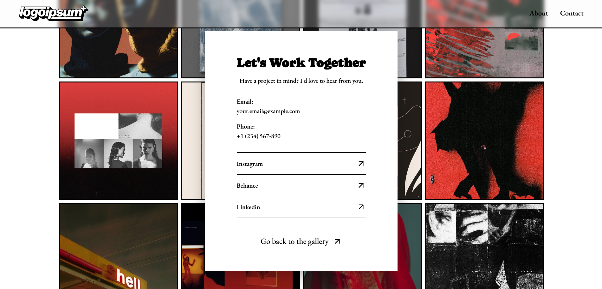

### AI Usage

Claude.ai (Sonnet 4.5) was used throughout the creation of this project to help navigate through the creation and troubleshooting of difficult elements. Each usage is documented as "plan0.md" in the docs folder.

### Credits and Acknowledgments

Creator: Robi Falagán
